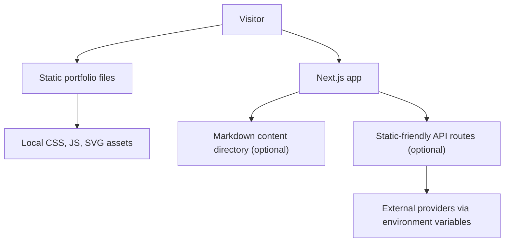

# Deepak Kumar Sahu Portfolio

[](https://github.com/dsahu1001-git/portfolio-website/actions/workflows/ci.yml)
[](LICENSE)

Static-first personal portfolio and learning project for `deepaksahu.dev`.

## What It Does

This repository contains two public-facing site surfaces:

- A plain HTML/CSS/vanilla JS portfolio in the repository root.
- A Next.js app scaffold for a modular portfolio and blog, with optional engagement sections.

It is intended as a personal learning and publishing project. It does not contain production infrastructure code, customer data, private employer code, or real service credentials.

## Architecture



## Quickstart

Prerequisites:

- Node.js 22.x
- npm 10.x or newer
- Git

```sh
git clone https://github.com/dsahu1001-git/portfolio-website.git
cd portfolio-website
cp .env.local.example .env.local
npm install
npm run dev
```

Open `http://localhost:3000`.

If the Next.js app renders as raw HTML after switching between build and dev mode,
reset the generated cache and start the dev server again:

```sh
npm run dev:clean
```

For the root static site only:

```sh
python3 -m http.server 8000
```

Open `http://localhost:8000`.

## Common Commands

```sh
make setup
make lint
make typecheck
make test
make scan-secrets
```

## Security Notes

- `.env.local.example` uses dummy values only.
- Do not commit `.env`, `.env.local`, private keys, cloud credentials, state files, or local kube/cloud config.
- GitHub Actions runs with `permissions: contents: read`. Deployment credentials are read from encrypted repository secrets only.
- Install dependencies with `npm ci` in automation so `package-lock.json` remains the reproducible source of truth.
- See [SECURITY.md](SECURITY.md) and [.github/REPO_HARDENING.md](.github/REPO_HARDENING.md).

## Deployment Notes

- The existing GitHub Pages site serves the root static portfolio from `main` at `https://deepaksahu.dev/` until the Next.js migration is approved.
- `.github/workflows/deploy-cloudflare.yml` packages the Next.js app with OpenNext and deploys `feature/**` branches to the separate `deepak-portfolio-preview` Cloudflare Worker.
- Pushes to `main` deploy the `deepak-portfolio` production Worker. Connecting the production Worker to `deepaksahu.dev` remains a separate domain cutover step.
- Add `CLOUDFLARE_API_TOKEN` and `CLOUDFLARE_ACCOUNT_ID` as GitHub Actions repository secrets before running the deployment workflow.
- `public/_headers` configures long-lived immutable caching for Next.js static assets on Cloudflare.
- `robots.txt`, `sitemap.xml`, and canonical metadata assume the production domain is `https://deepaksahu.dev/`.
- Social preview metadata uses `assets/og-image.svg`.

## Blog Post

Launch write-up: `https://deepaksahu.dev/blog` once the public announcement post is live.

## Known Limitations

- Some secondary engagement sections are intentionally lightweight until content is added.
- Contact/newsletter provider integrations require real environment variables and should be configured only outside Git.
- Affiliate redirects are restricted to HTTPS hostnames listed in `ALLOWED_AFFILIATE_HOSTS`.
- The root static site and Next.js app coexist during migration; deployment should choose one entrypoint explicitly.
- Remote image hosts are intentionally blocked by default in `next.config.mjs`; add explicit trusted hostnames before using external images.

## License

MIT. See [LICENSE](LICENSE).
